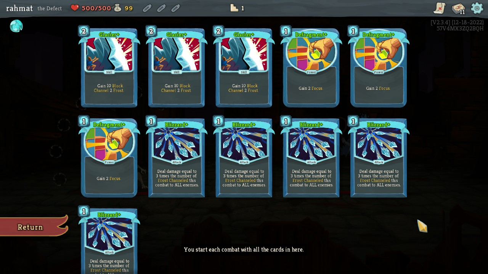
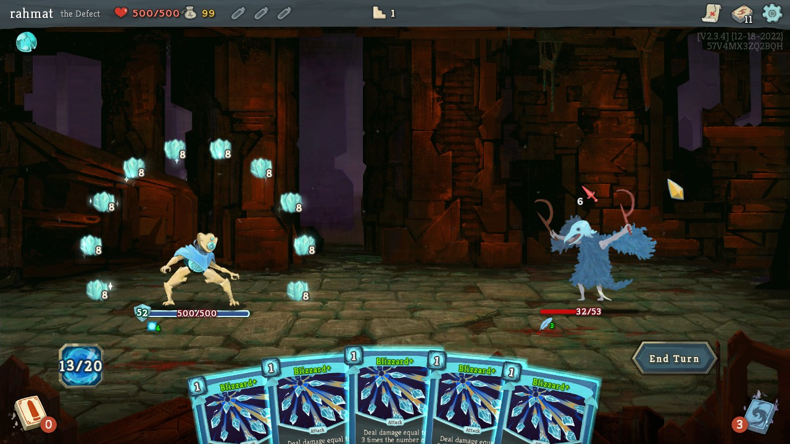

[Slay the Spire](https://store.steampowered.com/app/646570/Slay_the_Spire/) _faster_ by editing the save file! If done right, this will keep the fun while avoiding 
too much time to be wasted.

## How the script works
- It starts by finding an autosave file, usually named with this format: `<Name of the character>.autosave`, for example [DEFECT.autosave](example/DEFECT.autosave).
- It will then try to decrypt the save data and convert it to both readable and editable JSON object format [like so](example/readable_save_file.json).
- Edit the json object as needed.
- The script will then write it back to the obfuscated autosave file format

## Usage

### 1. Customize your save file

- Install python3 
- Inside `main.py`, change the `save_file_path` according to your game installation so that it points to the *root path* of the autosave file. On Windows default, it will usually be `C:\Program Files (x86)\Steam\steamapps\common\SlayTheSpire\saves`
- Edit the `main.py` as you need. You can change your health, build your own deck, etc. For example:

```python
from spireslayer.save_editor import SaveEditor
from spireslayer.decks import Deck
from spireslayer.card import Card

# Declare a valid path to the save folder
save_file_path = "C:\Program Files (x86)\Steam\steamapps\common\SlayTheSpire\saves"

# Declare a save editor that points to the save_file path
save_editor = SaveEditor(save_file_path)

# Edit whatever you want.
# here we are making our custom powerful deck for our Defect
save_editor.set_deck(Deck([
    Card(Card.GLACIER),
    Card(Card.GLACIER),
    Card(Card.GLACIER),
    Card(Card.DEFRAGMENT),
    Card(Card.DEFRAGMENT),
    Card(Card.DEFRAGMENT),
    Card(Card.BLIZZARD),
    Card(Card.BLIZZARD),
    Card(Card.BLIZZARD),
    Card(Card.BLIZZARD),
    Card(Card.BLIZZARD),
]))

# or increase our Defect's max orb
save_editor.update_max_orbs()

# or anything that can be adjustable to your need
save_editor.update_current_health()
save_editor.update_max_health()
save_editor.update_hand_size()
save_editor.update_energy_per_turn()

# After customization is finished, don't forget call this method to rewrite the save data back to where it belongs
save_editor.write_json_to_file()
```

### 2. Applying the save file

- Open the game, you can create a new game or continue. On the first encounter after loading the game, hit the menu and choose `Save & Quit`.
- From the main menu (no need to close the game), run your script.
- Back to your game and click `Continue`. Enjoy!




## Note

Currently, the package only supports The Defect.
For other character, you can create the method yourself (PR is greatly appreciated!) or alternatively use the provided API `SaveEditor.get_json()` to get the JSON formatted save file,  change the JSON directly, and assign it back with the provided API `SaveEditor.set_json()`. For example:

```python
from spireslayer.save_editor import SaveEditor

editor = SaveEditor(...)

save_file = editor.get_json()
save_file['current_health'] = 1000
editor.set_json(save_file)
```

Refer to the [save file example](example/readable_save_file.json) for more example.

## Disclaimer

I got the save file encryption logic from [Kirill89's gist](https://gist.github.com/Kirill89/514edad0ac80af7dfc036871ccf0f877) written in JS. What I did was only re-write it in python and added some feature so that the save data can be programmatically edited.
